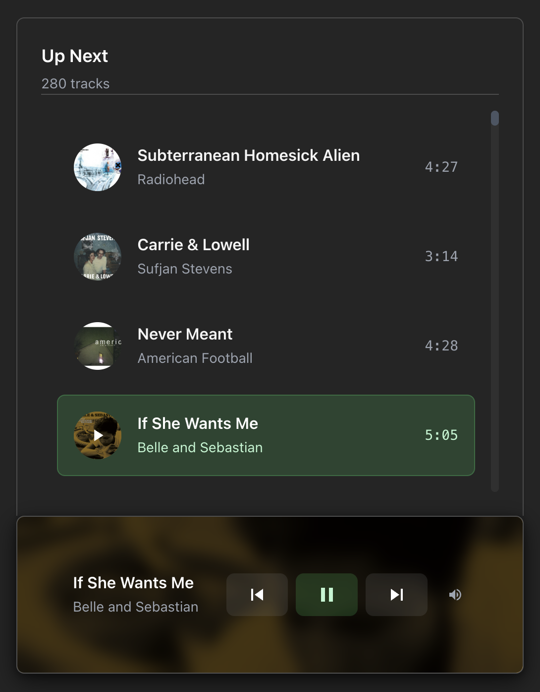

# Vorbis Player

A modern audio-visual player that combines Spotify music streaming with intelligent YouTube video discovery. Experience your music with automatic video accompaniment and a sleek, unified interface designed for continuous entertainment.



## Features

### 🎵 Audio Experience
- **Spotify Integration**: Stream high-quality music from your Spotify account (Premium required)
- **Auto-Play & Continuous Playback**: Automatically starts first song and seamlessly advances through tracks
- **Infinite Playlist**: Loops back to beginning when reaching the end of your music collection
- **Smart Retry System**: Hover over videos to retry with alternative content when embedding fails

### 🎬 Visual Experience  
- **Intelligent Video Discovery**: Automatically finds relevant YouTube videos for each track
- **Persistent Blacklist**: Remembers and avoids non-embeddable videos across sessions
- **Integrated Player Card**: Video and audio controls unified in a single elegant interface
- **Dynamic Backgrounds**: Album artwork creates immersive visual atmosphere

### 🎛️ User Interface
- **Sliding Playlist Drawer**: Space-saving collapsible playlist accessible from anywhere
- **Modern Card Design**: Clean, responsive interface with album artwork and visual hierarchy  
- **Mobile-Optimized**: Touch-friendly controls and responsive design for all devices
- **Hover Interactions**: Intuitive retry overlays and interactive elements

### 🔒 Security & Performance
- **Secure Authentication**: PKCE OAuth flow for safe Spotify access
- **Client-Side Intelligence**: Advanced video filtering and quality assessment
- **Persistent Storage**: Remembers failed videos and user preferences locally

## Quick Start

### Prerequisites

- Node.js 18+ and npm
- A Spotify Premium account
- Access to Spotify Developer Dashboard

### Installation

1. **Clone and install dependencies**

   ```bash
   git clone git@github.com:rmpacheco/vorbis-player.git
   cd vorbis-player
   npm install
   ```

2. **Set up Spotify App**
   - Create a new app at [Spotify Developer Dashboard](https://developer.spotify.com/dashboard)
   - Choose "Web Playback SDK" for planned API usage
   - Add redirect URI: `http://127.0.0.1:3000/auth/spotify/callback`
   - **Important**: Use `127.0.0.1` instead of `localhost` for Spotify OAuth compatibility
   - Copy your Client ID

3. **Configure environment**

   ```bash
   cp .env.local.example .env.local
   # Edit .env.local with your Spotify Client ID
   ```

   Required in `.env.local`:

   ```
   VITE_SPOTIFY_CLIENT_ID="your_spotify_client_id_here"
   VITE_SPOTIFY_REDIRECT_URI="http://127.0.0.1:3000/auth/spotify/callback"
   ```

4. **Prepare your Spotify account**
   - Ensure you have a Spotify Premium subscription
   - Create playlists with your favorite music
   - The app will access your playlists to display tracks

5. **Start the app**

   ```bash
   npm run dev
   ```

6. **First run**
   - Open <http://127.0.0.1:3000>
   - Click "Connect Spotify" to authenticate
   - Music starts automatically with accompanying videos
   - Click "📋 View Playlist" to browse your collection
   - Hover over any video to retry with alternative content if needed

## How It Works

### Audio-Visual Integration

- **Spotify Streaming**: High-quality music from your personal playlists and library
- **YouTube Discovery**: Intelligent search for relevant music videos using advanced filtering
- **Smart Matching**: Content filtering removes ads, low-quality, and irrelevant videos
- **Automatic Progression**: Seamless transitions between tracks with continuous video playback
- **Retry System**: Manual retry option finds alternative videos when embedding fails

### Playlist Management

- **Collapsible Interface**: Playlist drawer slides out when needed, maximizing video space
- **Track Selection**: Click any song to jump immediately to that track
- **Visual Feedback**: Current track highlighting and album artwork throughout interface
- **Responsive Design**: Optimized for both desktop and mobile interaction

### Authentication

- Uses secure PKCE OAuth flow
- Tokens stored locally with automatic refresh
- Required scopes: streaming, user-read-email, user-read-private, user-read-playback-state
- Requires Spotify Premium for playback functionality

## Development

### Available Scripts

```bash
npm run dev      # Start development server
npm run build    # Build for production  
npm run lint     # Run ESLint
npm run preview  # Preview production build
```

### Project Structure

```
src/
├── components/           # React components
│   ├── AudioPlayer.tsx  # Main orchestrator with integrated video player
│   ├── VideoPlayer.tsx  # YouTube video discovery and display
│   ├── Playlist.tsx     # Collapsible track listing drawer
│   ├── hyper-text.tsx   # Animated text component
│   └── styled/          # styled-components UI library
│       ├── Avatar.tsx   # Image component with fallback support
│       ├── Button.tsx   # Button component with variants
│       ├── Card.tsx     # Card layout components
│       └── index.ts     # Component exports
├── hooks/               # Custom React hooks
│   └── useDebounce.ts  # Debouncing utility hook
├── services/            # External service integrations
│   ├── spotify.ts      # Spotify Web API integration
│   ├── spotifyPlayer.ts # Spotify Web Playback SDK
│   ├── youtubeSearch.ts # YouTube video discovery service
│   ├── videoSearchOrchestrator.ts # Intelligent video matching
│   ├── contentFilter.ts # Video quality and relevance filtering
│   └── videoQuality.ts  # Video resolution and quality assessment
├── styles/             # Styling system
│   ├── theme.ts        # Design tokens and theme configuration
│   └── utils.ts        # styled-components utility mixins
└── lib/                # Utilities
    └── utils.ts        # Helper functions

public/
├── sw.js               # Service worker for caching and offline support
└── vorbis_player_logo.jpg # Application logo
```

### Tech Stack

- **Frontend**: React 18 + TypeScript + Vite
- **Styling**: styled-components with custom theme system
- **Audio**: Spotify Web Playback SDK
- **Video**: YouTube iframe embedding with intelligent discovery
- **Authentication**: Spotify Web API with PKCE OAuth
- **Content Intelligence**: Advanced filtering and quality assessment algorithms
- **Storage**: localStorage for persistent blacklist and user preferences
- **Build Tool**: Vite with HMR

## Deployment

Build for production:

```bash
npm run build
```

The `dist/` folder contains static files that can be deployed to any web hosting service (Vercel, Netlify, GitHub Pages, etc.).

**Note**: Update the Spotify redirect URI in your app settings to match your production domain.

## Troubleshooting

### "No tracks found"

- Ensure you have a Spotify Premium subscription
- Create playlists with music or like some songs in Spotify
- Check that your Spotify account has music accessible
- Verify your Spotify app has the correct scopes and permissions

### Video Issues

- **"Video unavailable"**: Hover over the video and click "🔄 Try Another" to find alternative content
- **No videos loading**: The app automatically searches for alternatives; this is normal behavior
- **Persistent video failures**: The system learns and avoids problematic videos automatically

### Authentication Issues

- Double-check your Client ID in `.env.local`
- Ensure redirect URI matches exactly in both `.env.local` and Spotify app settings
- Use `127.0.0.1` instead of `localhost` for Spotify OAuth compatibility
- Try clearing browser storage and re-authenticating

### Performance Issues

- Clear localStorage to reset video blacklist: `localStorage.clear()` in browser console
- Refresh the page if videos stop loading consistently
- The app is optimized for continuous playback; occasional video misses are expected
