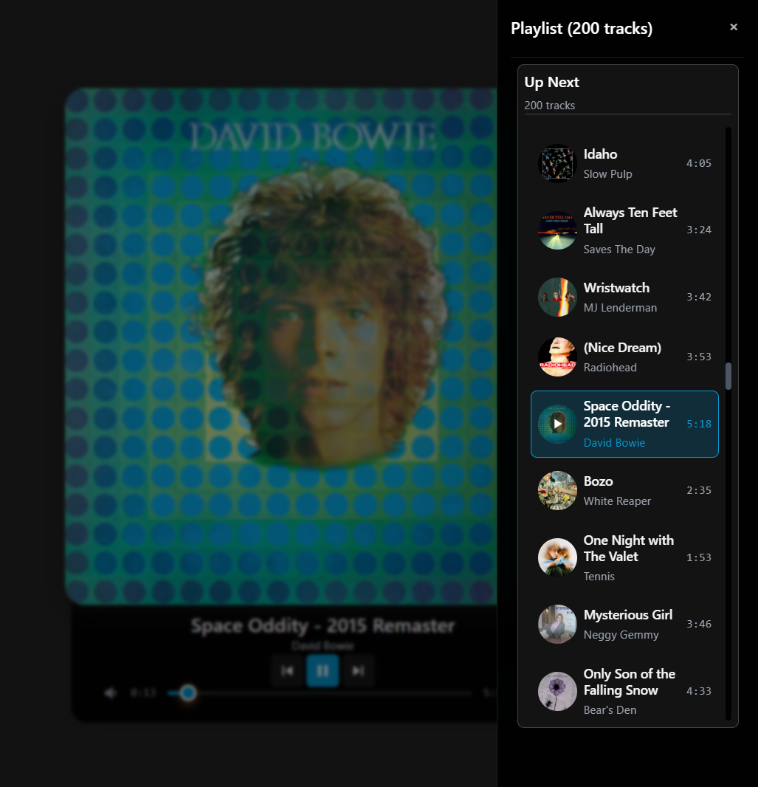
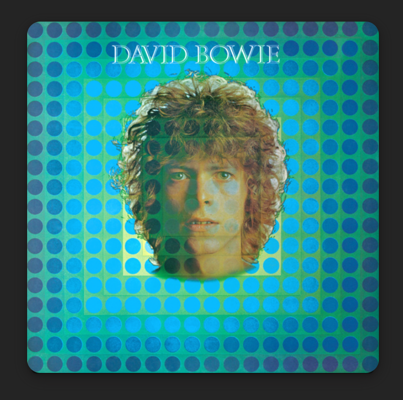

# Vorbis Player

A visually immersive Spotify music player built with React, featuring customizable visual effects, animated background visualizers, and a fully responsive design.





## Features

- **Spotify Integration**: Stream music from your Spotify account (Premium required)
- **Playlists & Albums**: Browse, search, sort, and filter your playlists and albums
- **Liked Songs**: Play your Liked Songs collection with automatic shuffle
- **Visual Effects**: Dynamic glow effects with configurable intensity and animation rate
- **Album Art Filters**: Real-time CSS filters (brightness, contrast, saturation, sepia, hue rotation, blur)
- **Background Visualizers**: Animated particle and geometric visualizer backgrounds
- **Custom Colors**: Pick accent colors per track from a color picker or eyedropper tool
- **Responsive Design**: Fluid layout that adapts from mobile phones to ultra-wide desktops
- **Keyboard Shortcuts**: Full keyboard control for playback, effects, and navigation

## Quick Start

### Prerequisites

- Node.js 18+ and npm
- A Spotify Premium account
- Access to [Spotify Developer Dashboard](https://developer.spotify.com/dashboard)

### Installation

1. **Clone and install**

   ```bash
   git clone git@github.com:smallorbit/vorbis-player.git
   cd vorbis-player
   npm install
   ```

2. **Set up Spotify App**
   - Create a new app at [Spotify Developer Dashboard](https://developer.spotify.com/dashboard)
   - Choose "Web Playback SDK" for planned API usage
   - Add redirect URI: `http://127.0.0.1:3000/auth/spotify/callback`
   - **Important**: Use `127.0.0.1` instead of `localhost` for Spotify OAuth compatibility
   - Copy your Client ID

3. **Configure environment**

   ```bash
   cp .env.example .env.local
   # Edit .env.local with your Spotify Client ID
   ```

   Required in `.env.local`:

   ```
   VITE_SPOTIFY_CLIENT_ID="your_spotify_client_id_here"
   VITE_SPOTIFY_REDIRECT_URI="http://127.0.0.1:3000/auth/spotify/callback"
   ```

4. **Start the app**

   ```bash
   npm run dev
   ```

5. **First run**
   - Open <http://127.0.0.1:3000>
   - Click "Connect Spotify" to authenticate
   - Choose from your playlists, albums, or select "Liked Songs" for shuffled playback

## User Interface

### Compact Mode
Click on the album art to toggle between Compact mode (album art only) and Expanded mode. In Compact mode, the player shows just the album artwork for a clean, immersive view.

### Expanded Mode
In Expanded mode, side panels and bottom controls are visible:

**Left Panel** - Quick visual effect toggles:
- Glow effect toggle
- Background visualizer toggle

**Right Panel** - Navigation and settings:
- Back to library
- Playlist drawer toggle
- Visual effects menu
- Color picker for accent color

**Bottom Controls**:
- Track name and artist
- Playback controls (previous, play/pause, next)
- Timeline slider, volume control, and like button

### Playlist Selection

The playlist selection screen supports:
- **Search**: Filter playlists and albums by name
- **Sort**: Sort by recently added, name, artist, or release date
- **Filter**: Filter albums by decade
- **View Modes**: Toggle between Playlists and Albums tabs
- **Liked Songs**: Special entry with shuffle indicator

### Visual Effects Menu

The visual effects menu (opened via the gear icon) provides control over:

**Glow Effect**: Intensity (Less/Normal/More), Rate (Slower/Normal/Faster), Accent color background toggle

**Background Visualizer**: Style (Particles or Geometric), Intensity (0-100%)

**Album Art Filters**: Brightness, Saturation, Sepia, Contrast with one-click reset

### Keyboard Shortcuts

| Key | Action |
|-----|--------|
| `Space` | Play/Pause |
| `ArrowRight` / `ArrowLeft` | Next / Previous track |
| `ArrowUp` / `ArrowDown` | Volume up / down |
| `P` | Toggle playlist drawer |
| `V` | Toggle background visualizer |
| `G` | Toggle glow effect |
| `O` | Open visual effects menu |
| `L` | Like/unlike current track |
| `M` | Mute/unmute |
| `/` or `?` | Show keyboard shortcuts help |
| `Escape` | Close all menus |

Press `/` or `?` in the app to see the full shortcuts overlay.

## Development

### Available Scripts

```bash
npm run dev          # Start development server
npm run build        # Build for production (tsc -b && vite build)
npm run lint         # Run ESLint
npm run preview      # Preview production build
npm run test         # Run tests in watch mode
npm run test:run     # Run tests once
npm run test:ui      # Run tests with UI
npm run test:coverage # Run tests with coverage
```

### Project Structure

```
src/
├── components/              # React components (43 files)
│   ├── AudioPlayer.tsx      # Main orchestrator with centralized state
│   ├── PlayerContent.tsx    # Main player layout (centering, responsive sizing)
│   ├── PlayerStateRenderer.tsx  # Loading/error/playlist selection states
│   ├── AlbumArt.tsx         # Album artwork with filters & glow effects
│   ├── PlaylistSelection.tsx    # Playlist/album browser with search/sort/filter
│   ├── SpotifyPlayerControls.tsx # Player control interface
│   ├── PlaylistDrawer.tsx   # Sliding track list drawer
│   ├── LeftQuickActionsPanel.tsx # Left-side quick toggles
│   ├── QuickActionsPanel.tsx    # Right-side actions panel
│   ├── ColorPickerPopover.tsx   # Per-track color picker
│   ├── controls/            # Player control sub-components
│   ├── styled/              # Reusable styled-components library
│   ├── ui/                  # Radix UI component wrappers
│   ├── visualizers/         # Background visualizer components
│   └── VisualEffectsMenu/   # Visual effects configuration panel
├── hooks/                   # 17 custom React hooks
├── services/                # Spotify API & Playback SDK integration
├── utils/                   # Utility functions (color, sizing, filters)
├── styles/                  # Theme, global styles, CSS animations
├── types/                   # TypeScript definitions
├── workers/                 # Web Workers (image processing)
└── lib/                     # Helper functions
```

### Tech Stack

- **Frontend**: React 18 + TypeScript + Vite
- **Styling**: styled-components with theme system + Radix UI primitives
- **Audio**: Spotify Web Playback SDK + Web API
- **Authentication**: PKCE OAuth 2.0 flow
- **Testing**: Vitest + React Testing Library
- **Performance**: Web Workers, LRU caching, lazy loading, container queries

## Deployment

### Deploy to Vercel (Recommended)

For detailed instructions, see [deploy-to-vercel.md](./docs/deployment/deploy-to-vercel.md).

**Quick Deploy:**
1. Push your code to GitHub/GitLab/Bitbucket
2. Connect your repository to [Vercel](https://vercel.com)
3. Set environment variables:
   - `VITE_SPOTIFY_CLIENT_ID`: Your Spotify app's Client ID
   - `VITE_SPOTIFY_REDIRECT_URI`: `https://your-app.vercel.app/auth/spotify/callback`
4. Deploy!

### Manual Build

```bash
npm run build
```

The `dist/` folder contains static files deployable to any web hosting service.

**Important**: Update the Spotify redirect URI in your app settings to match your production domain.

## Troubleshooting

### "No tracks found"
- Ensure you have a Spotify Premium subscription
- Create playlists with music or like some songs in Spotify

### Authentication Issues
- Double-check your Client ID in `.env.local`
- Ensure redirect URI matches exactly in both `.env.local` and Spotify app settings
- Use `127.0.0.1` instead of `localhost`

### Visual Effects Issues
- Clear localStorage to reset visual settings to defaults
- Background visualizer requires Canvas API support
- CSS filters require a modern browser
