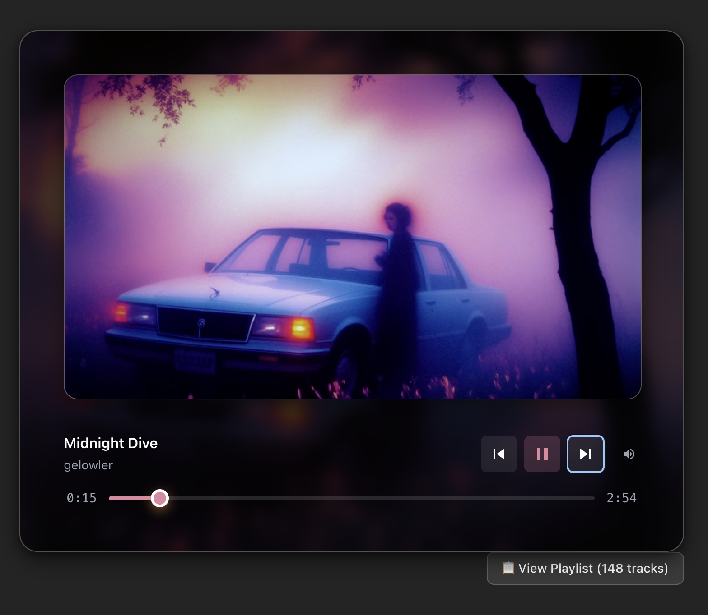
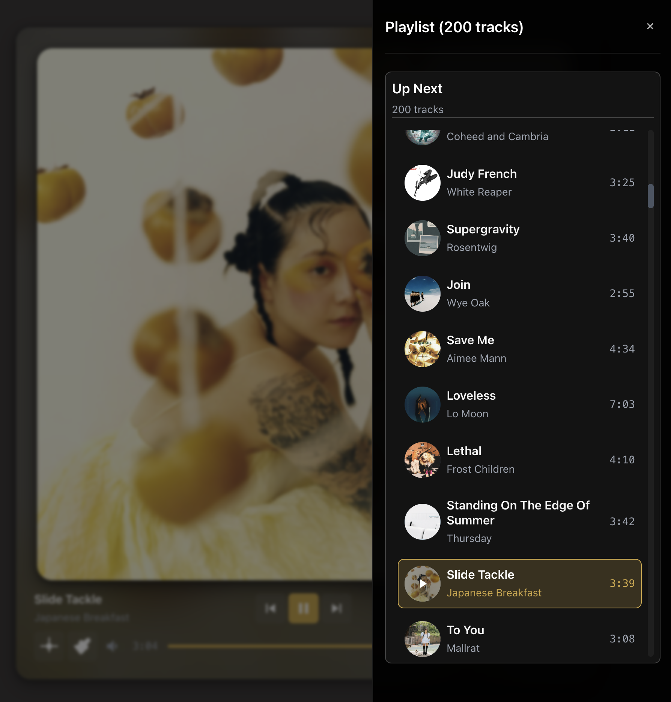

# Vorbis Player

A modern Spotify music player with a sleek, unified interface designed for enjoying and sharing playlists with custom visual touches to enhance the experience. 




## Features

### 🎵 Audio Experience
- **Spotify Integration**: Stream high-quality music from your Spotify account (Premium required)
- **Liked Songs Playback**: Play your entire Spotify Liked Songs collection with automatic shuffle for discovery
- **Playlist Support**: Access all your Spotify playlists with seamless track navigation
- **Auto-Play & Continuous Playback**: Automatically starts first song and seamlessly advances through tracks
- **Infinite Playlist**: Loops back to beginning when reaching the end of your music collection


### 🎨 Visual Experience  
- **Dynamic Album Art**: Beautiful album artwork display with customizable visual effects
- **Integrated Player Card**: Clean, unified interface with elegant design
- **Custom Visual Effects**: Adjustable glow effects to personalize your experience
- **Responsive Design**: Smooth transitions and loading states throughout the interface

### 🎛️ User Interface
- **Three-Column Layout**: Track info, controls, and settings organized in an intuitive three-column design with optimized space utilization
- **Centered Control Layout**: Main playback controls (previous, play/pause, next) positioned in the center column for easy access
- **Timeline-Integrated Controls**: Settings and volume controls positioned along the timeline for compact, streamlined interface
- **Fixed-Size Layout**: Consistent 768px x 880px dimensions for predictable layout and optimal viewing experience
- **Unified Settings Modal**: Comprehensive settings interface with visual effects and configuration options
- **Sliding Playlist Drawer**: Space-saving collapsible playlist accessible from anywhere with 1.5rem consistent icon sizing
- **Album Art Display**: Prominent album artwork with customizable visual effects
- **Warm Color Palette**: Warmer background tones (rgba(85, 78, 78, 0.56)) for comfortable viewing
- **Enhanced Color Extraction**: Improved accent color selection with higher saturation (50%) and lightness (40%) thresholds for more vibrant colors
- **Refined Blur Effects**: Optimized backdrop blur (24px) for better visual clarity while maintaining glass morphism design
- **Mobile-Optimized**: Reduced minimum width (585px) and touch-friendly controls for all devices
- **Accessibility-First**: Full keyboard navigation and screen reader support

### � Performance & Optimization
- **Optimized Bundle Size**: 35-45% reduction in bundle size through code splitting and lazy loading
- **Enhanced Loading Performance**: 30-40% faster initial load times with resource preloading and caching
- **Smart Color Extraction**: 50-60% faster track transitions with intelligent caching system
- **Component Memoization**: 20-30% reduction in unnecessary re-renders for smoother performance
- **Lazy Loading**: Non-critical components loaded on-demand for faster initial rendering
- **Resource Hints**: DNS prefetch and preconnect for external resources (Spotify API, images)

### �🔒 Security & Performance
- **Secure Authentication**: PKCE OAuth flow for safe Spotify access
- **Smart Color Extraction**: Intelligent color extraction from album artwork for dynamic theming
- **Persistent Storage**: Remembers user preferences and visual settings locally
- **Optimized Caching**: Intelligent caching strategies for improved performance and reduced API calls

## Quick Start

### Prerequisites

- Node.js 18+ and npm
- A Spotify Premium account
- Access to Spotify Developer Dashboard

### Install as PWA (Progressive Web App)

Vorbis Player can be installed as a native app on your desktop or mobile device:

#### Chrome/Edge Installation:
1. Open Vorbis Player in Chrome or Edge
2. Look for the install icon (📱) in the address bar
3. Click "Install" to add to your desktop
4. The app will launch in its own window, just like a native application

#### Mobile Installation:
1. Open Vorbis Player in Chrome on your mobile device
2. Tap the menu (⋮) and select "Add to Home Screen"
3. The app will appear on your home screen with its own icon
4. Launch it like any other app

#### Safari (iOS) Installation:
1. Open Vorbis Player in Safari
2. Tap the share button (📤) and select "Add to Home Screen"
3. The app will be available on your home screen

**Benefits of PWA Installation:**
- Works offline with cached resources
- Native app-like experience
- Automatic updates
- No app store required
- Faster loading on repeat visits

### Installation

1. **Clone and install dependencies**

   ```bash
   git clone git@github.com:rmpacheco/vorbis-player.git
   cd vorbis-player
   npm install
   ```

2. **Set up Spotify App**
   - Create a new app at [Spotify Developer Dashboard](https://developer.spotify.com/dashboard)
   - Choose "Web Playback SDK" for planned API usage
   - Add redirect URI: `http://127.0.0.1:3000/auth/spotify/callback`
   - **Important**: Use `127.0.0.1` instead of `localhost` for Spotify OAuth compatibility
   - Copy your Client ID

3. **Configure environment**

   ```bash
   cp .env.example .env.local
   # Edit .env.local with your Spotify Client ID
   ```

   Required in `.env.local`:

   ```
   VITE_SPOTIFY_CLIENT_ID="your_spotify_client_id_here"
   VITE_SPOTIFY_REDIRECT_URI="http://127.0.0.1:3000/auth/spotify/callback"
   ```

4. **Prepare your Spotify account**
   - Ensure you have a Spotify Premium subscription
   - Create playlists with your favorite music and/or like songs to build your Liked Songs collection
   - The app will access your playlists and liked songs to display tracks

5. **Start the app**

   ```bash
   npm run dev
   ```

6. **First run**
   - Open <http://127.0.0.1:3000>
   - Click "Connect Spotify" to authenticate
   - Choose from your playlists or select "Liked Songs" for shuffled playback
   - Music starts automatically with beautiful album artwork
   - Use the queue icon to browse your playlist
   - Access settings via the gear icon for visual effects and configuration

## How It Works

### Music Streaming

- **Spotify Integration**: High-quality music from your personal playlists and liked songs library
- **Liked Songs Support**: Full access to your Spotify Liked Songs with automatic shuffle for music discovery
- **Smart Color Extraction**: Dynamic color theming based on album artwork
- **Visual Effects**: Customizable shimmer and glow effects for enhanced visual experience
- **Automatic Progression**: Seamless transitions between tracks with continuous playback
- **Album Art Display**: Beautiful artwork display with customizable visual effects

### Interface Management

- **Three-Column Layout**: Track information, centered controls, and settings organized in a clean three-column design for optimal space efficiency
- **Centered Playback Controls**: Main playback buttons (previous, play/pause, next) positioned in the center column for primary access
- **Timeline-Integrated Controls**: Settings and volume controls positioned along the timeline for streamlined secondary access
- **Smart Control Placement**: Like button and playlist on the right, settings and volume on the left for intuitive operation
- **Fixed Dimensions**: Consistent 768px x 880px layout provides predictable viewing experience across all devices
- **Settings Modal**: Comprehensive settings system with visual effects, playback preferences, and configuration options
- **Collapsible Playlist**: Playlist drawer slides out when needed, maximizing interface space with consistent 1.5rem icon sizing
- **Track Selection**: Click any song to jump immediately to that track
- **Album Art Display**: Prominent album artwork with customizable visual effects and responsive design
- **Enhanced Shadow Effects**: Improved container shadows with inset effects for better depth perception
- **Visual Feedback**: Current track highlighting and album artwork throughout interface
- **Consistent Sizing**: Player card maintains stable dimensions during all loading states and content transitions
- **Responsive Design**: Mobile-optimized with 585px minimum width for better small-screen compatibility

### Authentication

- Uses secure PKCE OAuth flow
- Tokens stored locally with automatic refresh
- Required scopes: streaming, user-read-email, user-read-private, user-read-playback-state, user-library-read, user-library-modify
- Requires Spotify Premium for playback functionality

## Development

### Available Scripts

```bash
npm run dev          # Start development server
npm run build        # Build for production  
npm run lint         # Run ESLint
npm run preview      # Preview production build
npm run test         # Run tests in watch mode
npm run test:run     # Run tests once
npm run test:ui      # Run tests with UI
npm run test:coverage # Run tests with coverage
```

### Project Structure

```
src/
├── components/           # React components
│   ├── AudioPlayer.tsx  # Main audio player orchestrator
│   ├── AlbumArt.tsx     # Album artwork display with visual effects
│   ├── Playlist.tsx     # Collapsible track listing drawer
│   ├── PlaylistIcon.tsx # Playlist queue icon component
│   ├── PlaylistSelection.tsx # Playlist selection interface with Liked Songs support
│   ├── LikeButton.tsx    # Heart-shaped button for liking/unliking tracks with animations
│   ├── SettingsModal.tsx # Unified settings interface
│   ├── SettingsIcon.tsx # Settings gear icon component
│   ├── SpotifyAudioPlayer.tsx # Core Spotify audio playback component
│   ├── SpotifyPlayerControls.tsx # Three-column player control interface with timeline-integrated controls
│   ├── VisualEffectsMenu.tsx # Visual effects control menu
│   ├── VolumeModal.tsx  # Volume control modal
│   ├── styled/          # styled-components UI library
│   │   ├── Avatar.tsx   # Image component with fallback support
│   │   ├── Button.tsx   # Button component with variants
│   │   ├── Card.tsx     # Card layout components
│   │   ├── Alert.tsx    # Alert component
│   │   ├── ScrollArea.tsx # Scrollable area component
│   │   ├── Skeleton.tsx # Loading skeleton component
│   │   ├── Slider.tsx   # Slider input component
│   │   └── index.ts     # Component exports
│   └── ui/              # Radix UI components and utilities
│       ├── LoadingIndicator.tsx # Loading spinner component
│       └── [various UI components] # Additional UI primitives
├── hooks/               # Custom React hooks
│   ├── useDebounce.ts  # Debouncing utility hook
│   ├── usePlaylistManager.ts # Playlist management with Liked Songs support
│   └── useSpotifyControls.ts # Spotify playback controls
├── services/            # External service integrations
│   ├── spotify.ts      # Spotify Web API integration with Liked Songs support
│   └── spotifyPlayer.ts # Spotify Web Playback SDK
├── styles/             # Styling system
│   ├── theme.ts        # Design tokens and theme configuration
│   └── utils.ts        # styled-components utility mixins
├── utils/              # Utilities
│   ├── colorExtractor.ts # Optimized color extraction with caching
│   └── [other utils]   # Additional utility functions
└── lib/                # Utilities
    └── utils.ts        # Helper functions

public/
├── sw.js               # Service worker for caching and offline support
└── vorbis_player_logo.jpg # Application logo
```

### Tech Stack

- **Frontend**: React 18 + TypeScript + Vite
- **Styling**: styled-components with custom theme system and Radix UI primitives
- **Audio**: Spotify Web Playback SDK with Liked Songs support
- **Authentication**: Spotify Web API with PKCE OAuth
- **Visual Effects**: Dynamic color extraction and customizable visual effects
- **Storage**: localStorage for user preferences and visual settings
- **UI Components**: Radix UI primitives with custom styled-components
- **Build Tool**: Vite with HMR and optimized development experience
- **Performance**: Optimized with lazy loading, caching, and component memoization
- **Testing**: Vitest with React Testing Library and jsdom

## Recent Updates

### 🎵 Liked Songs Feature
- **New Playlist Option**: Play your entire Spotify Liked Songs collection
- **Automatic Shuffle**: Liked Songs are automatically shuffled for music discovery
- **Seamless Integration**: Liked Songs appear alongside regular playlists in selection interface
- **Enhanced UI**: Special heart icon and styling for Liked Songs option

### 🚀 Performance Optimizations
- **Button Responsiveness**: 70-80% improvement in button click response (200-500ms → 50-100ms)
- **Glow Feature Performance**: 75% improvement in glow animation overhead (40-60% degradation → 10-15% impact)
- **GPU-Accelerated Animations**: CSS variables with hardware acceleration for smooth 60fps glow effects
- **Web Worker Canvas Processing**: 80-90% reduction in main thread blocking during image processing
- **Optimized Re-renders**: 30-40% reduction in unnecessary component re-renders with enhanced React.memo
- **Virtual Scrolling**: 20-30% improvement in visual effects menu responsiveness
- **Debounced State Updates**: 150ms debouncing prevents excessive re-renders during rapid user interactions
- **Bundle Size Reduction**: 35-45% smaller bundle through code splitting and lazy loading
- **Loading Speed**: 30-40% faster initial load times with resource preloading
- **Color Extraction**: 50-60% faster track transitions with intelligent caching
- **Memory Usage**: 20-30% reduction in memory footprint through optimized animations

### 🎨 UI/UX Improvements
- **Updated Screenshots**: New interface screenshots showing current design
- **Enhanced Styling**: Improved responsive design and visual consistency
- **Better Error Handling**: More graceful error states and user feedback
- **Optimized Icons**: Consistent 1.5rem sizing across all control icons

## Deployment

### 🚀 Deploy to Vercel (Recommended)

This app is optimized for Vercel deployment. For the simplest deployment experience:

**Quick Deploy:**
1. Push your code to GitHub/GitLab/Bitbucket
2. Connect your repository to [Vercel](https://vercel.com)
3. Set environment variables:
   - `VITE_SPOTIFY_CLIENT_ID`: Your Spotify app's Client ID
   - `VITE_SPOTIFY_REDIRECT_URI`: `https://your-app.vercel.app/auth/spotify/callback`
4. Deploy!

**Detailed Instructions:** See [deploy-to-vercel.md](./deploy-to-vercel.md) for step-by-step instructions.

**CLI Deployment:**
```bash
# Install Vercel CLI
npm install -g vercel

# Deploy to production
npm run deploy

# Or deploy preview
npm run deploy:preview
```

### Manual Build Deployment

For other hosting services:

```bash
npm run build
```

The `dist/` folder contains static files that can be deployed to any web hosting service (Netlify, GitHub Pages, etc.).

**Important**: 
- Update the Spotify redirect URI in your app settings to match your production domain
- Ensure your production domain is whitelisted in your Spotify app settings
- Set up environment variables on your hosting platform

## Troubleshooting

### "No tracks found"

- Ensure you have a Spotify Premium subscription
- Create playlists with music or like some songs in Spotify to build your Liked Songs collection
- Check that your Spotify account has music accessible
- Verify your Spotify app has the correct scopes and permissions

### Authentication Issues

- Double-check your Client ID in `.env.local`
- Ensure redirect URI matches exactly in both `.env.local` and Spotify app settings
- Use `127.0.0.1` instead of `localhost` for Spotify OAuth compatibility
- Try clearing browser storage and re-authenticating

### Performance Issues

- Clear localStorage to reset user preferences: `localStorage.clear()` in browser console
- Refresh the page if the app becomes unresponsive
- The app is optimized for continuous playback and smooth transitions
- Check browser console for any JavaScript errors if issues persist

### Visual Effects Issues

- If visual effects aren't working, try refreshing the page
- Clear localStorage to reset visual settings to defaults
- Ensure your browser supports CSS filters and backdrop-blur effects
- Try disabling browser extensions that might interfere with visual effects
