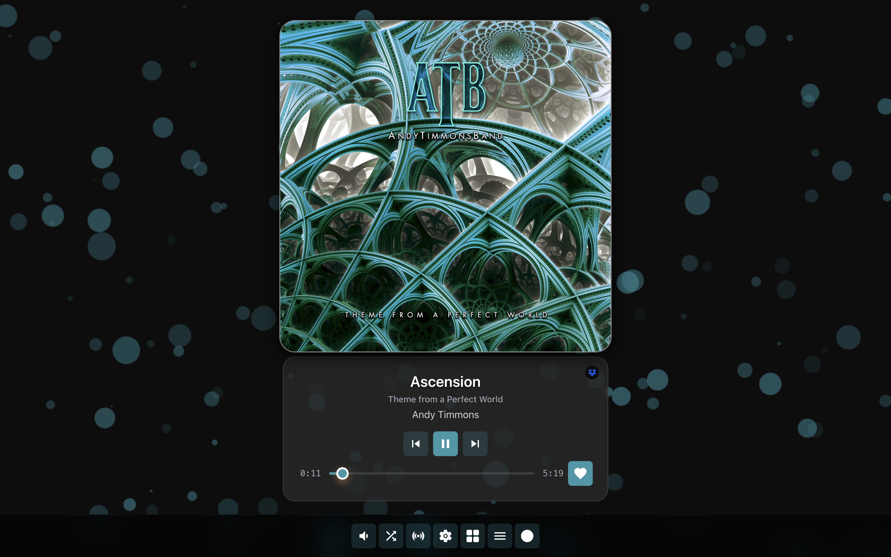
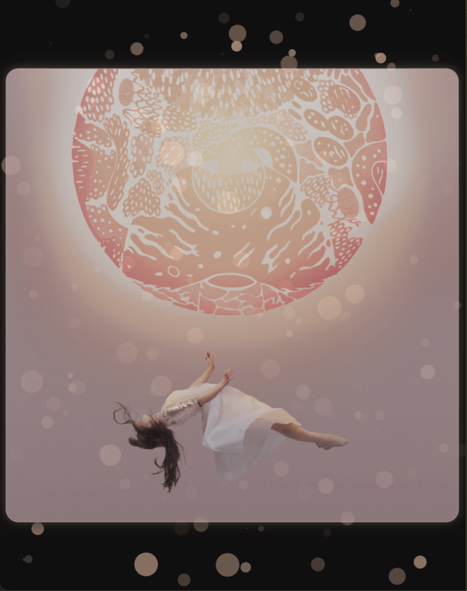
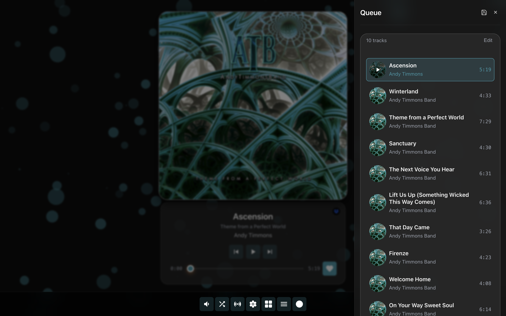
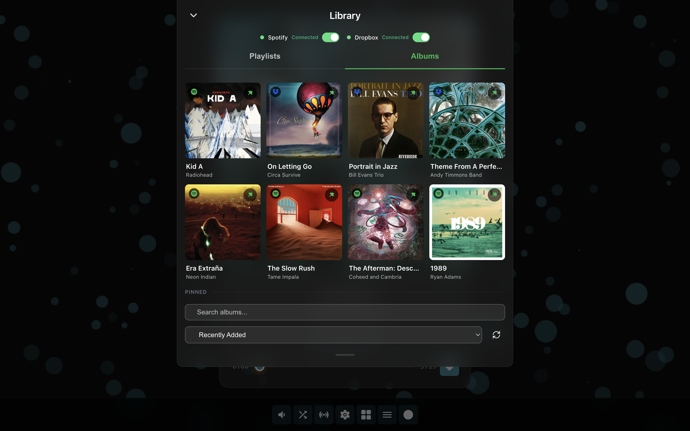

# Vorbis Player

A music player with visualizers and multi-provider support (Spotify, Dropbox), built for enjoying music and album art. Features customizable visual effects, animated background visualizers, unified playback, and a fully responsive design.

## See the glow and visualizers in action
<video src="https://github.com/user-attachments/assets/e1c97122-0ef6-4f7a-8e43-1004529d6aa2" controls autoplay loop muted></video>

## Screenshots

#### Normal mode


#### Zen mode


#### Queue drawer


#### Library drawer



## Features

- **Multi-Provider Support** — Stream from Spotify or your personal Dropbox music library
- **Unified Cross-Provider Playback** — Keep playback controls consistent across mixed Spotify + Dropbox queues
- **Zen Mode** — Distraction-free playback with hover-activated controls (desktop) or touch gestures (mobile), album art focus, and auto-hiding bottom bar
- **Queue** — See and edit what plays next (reorder, remove, deduplicate) in the queue drawer or mobile sheet
- **Playlists & Albums** — Browse, search, sort, filter, and pin your **library** collections (not the same as the playback queue)
- **Unified Liked Songs** — Merge liked tracks from connected providers into one queue; "Play Liked" and "Queue Liked" filter any collection to just your favorites
- **Track Radio** — Generate a one-shot radio playlist from the current track (Last.fm-powered matching)
- **Visual Effects** — Dynamic glow, configurable album art filters, accent color backgrounds
- **Background Visualizers** — Animated particle and geometric visualizer backgrounds
- **Album Art Flip Menu** — Tap album art to reveal quick-access visual controls
- **Swipe Gestures** — Swipe to change tracks, open the queue, or browse the library
- **Keyboard Shortcuts** — Context-aware controls with device-specific behavior
- **Responsive Design** — Fluid layout from mobile phones to ultra-wide desktops
- **Session Resume** — Pick up where you left off — playback position, queue, and track are restored on reopen
- **Instant Startup** — IndexedDB-based library cache with background sync

## Quick Start

```bash
git clone git@github.com:smallorbit/vorbis-player.git
cd vorbis-player
npm install
cp .env.example .env.local   # Add your provider credentials
# For local dev, set VITE_SPOTIFY_REDIRECT_URI=http://127.0.0.1:3000/auth/spotify/callback
npm run dev                   # Open http://127.0.0.1:3000
```

You'll need credentials from at least one provider. See the **[Getting Started Guide](./docs/getting-started.md)** for full setup instructions including provider configuration.

For radio recommendations, also set `VITE_LASTFM_API_KEY` in `.env.local` (see `.env.example`).

## Documentation

| Guide | Description |
|-------|-------------|
| **[Getting Started](./docs/getting-started.md)** | Installation, environment setup, and first run |
| **[User Guide](./docs/user-guide.md)** | All player features, controls, and keyboard shortcuts |
| **[Contributing](./docs/contributing.md)** | Development setup, project structure, coding conventions |
| **[Architecture](./CLAUDE.md#architecture)** | System design, provider model, playback flow |
| **[Troubleshooting](./docs/troubleshooting.md)** | Common issues and solutions |

### Provider Setup

| Provider | Guide | Requirements |
|----------|-------|-------------|
| Spotify | **[Spotify Setup](./docs/providers/spotify-setup.md)** | Spotify Premium + Developer App |
| Dropbox | **[Dropbox Setup](./docs/providers/dropbox-setup.md)** | Dropbox account with audio files |

### Deployment

| Platform | Guide |
|----------|-------|
| Vercel | **[Deploy to Vercel](./docs/deployment/deploy-to-vercel.md)** |

## Design language

The UI follows a flat-first approach: nearly all rectangular surfaces (cards, drawers, menus, list items) use zero border radius via `theme.borderRadius.flat`. Only the album art and the player panel immediately below it keep rounded corners; thumbnails use a small 6 px radius (`theme.borderRadius.md`); circular elements (icon buttons) stay fully round. This keeps the visual language crisp and avoids arbitrary radius values scattered across components.

## Tech Stack

React 18 · TypeScript 5 · Vite 6 · styled-components · Radix UI · Vitest

## License

MIT
