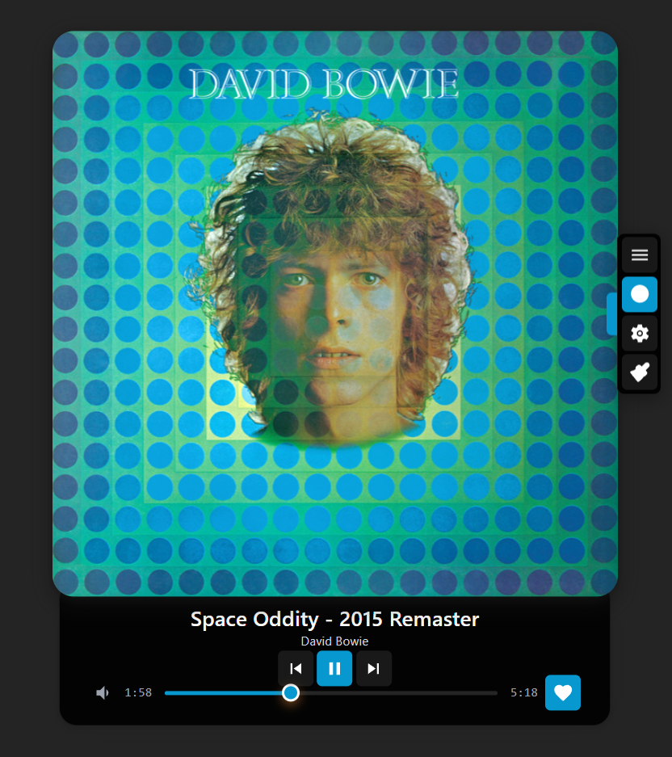
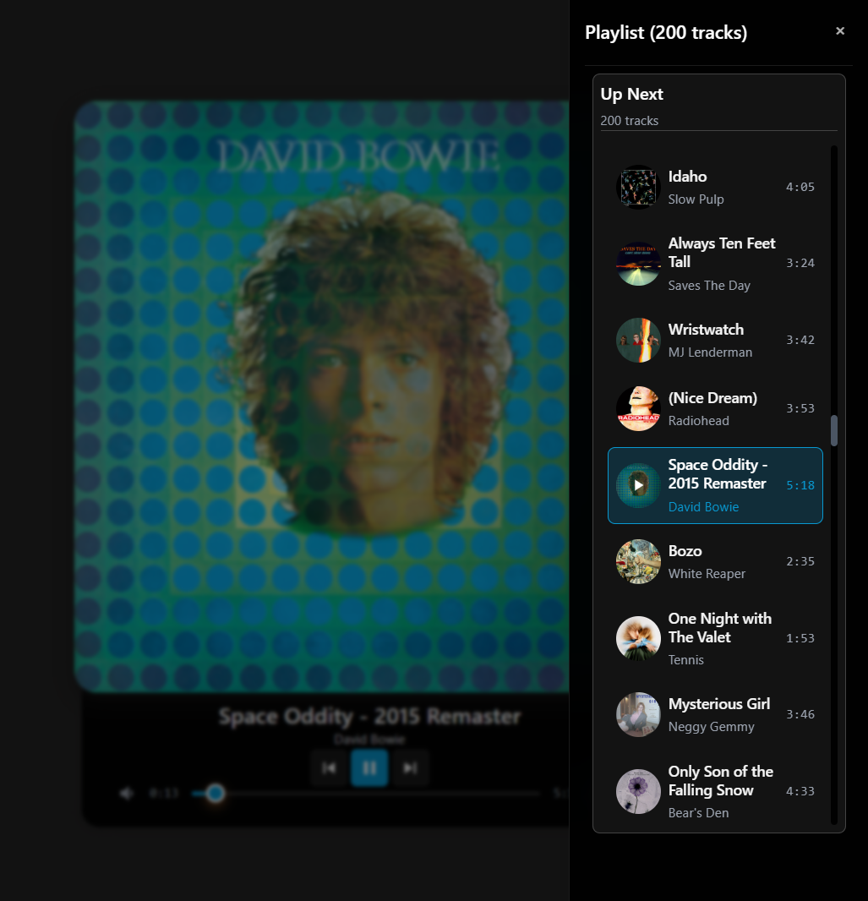
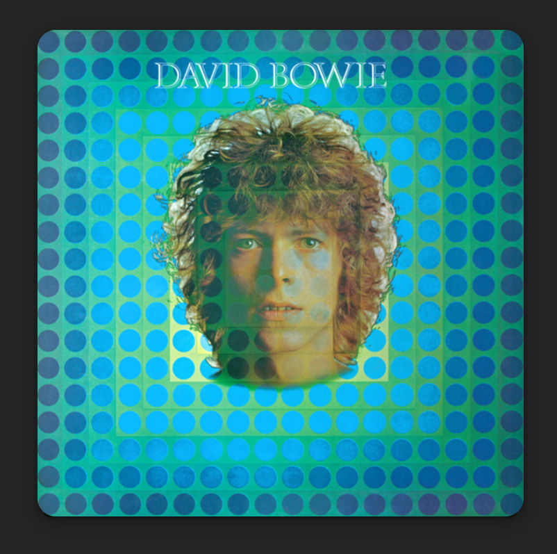

# Vorbis Player

A visually immersive music player built with React and TypeScript, featuring customizable visual effects, animated background visualizers, and a fully responsive design. Supports streaming from **Spotify** (Premium required) and playing personal audio files from **Dropbox**.





## Features

- **Multi-Provider Support** — Stream from Spotify or your personal Dropbox music library
- **Playlists & Albums** — Browse, search, sort, filter, and pin your collections
- **Liked Songs** — Play your Liked Songs collection with automatic shuffle
- **Visual Effects** — Dynamic glow, configurable album art filters, accent color backgrounds
- **Background Visualizers** — Animated particle and geometric visualizer backgrounds
- **Album Art Flip Menu** — Tap album art to reveal quick-access visual controls
- **Swipe Gestures** — Swipe to change tracks, open playlists, or browse the library
- **Keyboard Shortcuts** — Context-aware controls with device-specific behavior
- **Responsive Design** — Fluid layout from mobile phones to ultra-wide desktops
- **Instant Startup** — IndexedDB-based library cache with background sync

## Quick Start

```bash
git clone git@github.com:smallorbit/vorbis-player.git
cd vorbis-player
npm install
cp .env.example .env.local   # Add your provider credentials
npm run dev                   # Open http://127.0.0.1:3000
```

You'll need credentials from at least one provider. See the **[Getting Started Guide](./docs/getting-started.md)** for full setup instructions including provider configuration.

## Documentation

| Guide | Description |
|-------|-------------|
| **[Getting Started](./docs/getting-started.md)** | Installation, environment setup, and first run |
| **[User Guide](./docs/user-guide.md)** | All player features, controls, and keyboard shortcuts |
| **[Contributing](./docs/contributing.md)** | Development setup, project structure, coding conventions |
| **[Troubleshooting](./docs/troubleshooting.md)** | Common issues and solutions |

### Provider Setup

| Provider | Guide | Requirements |
|----------|-------|-------------|
| Spotify | **[Spotify Setup](./docs/providers/spotify-setup.md)** | Spotify Premium + Developer App |
| Dropbox | **[Dropbox Setup](./docs/providers/dropbox-setup.md)** | Dropbox account with audio files |

### Deployment

| Platform | Guide |
|----------|-------|
| Vercel | **[Deploy to Vercel](./docs/deployment/deploy-to-vercel.md)** |

## Tech Stack

React 18 · TypeScript 5 · Vite 6 · styled-components · Radix UI · Vitest

## License

MIT
