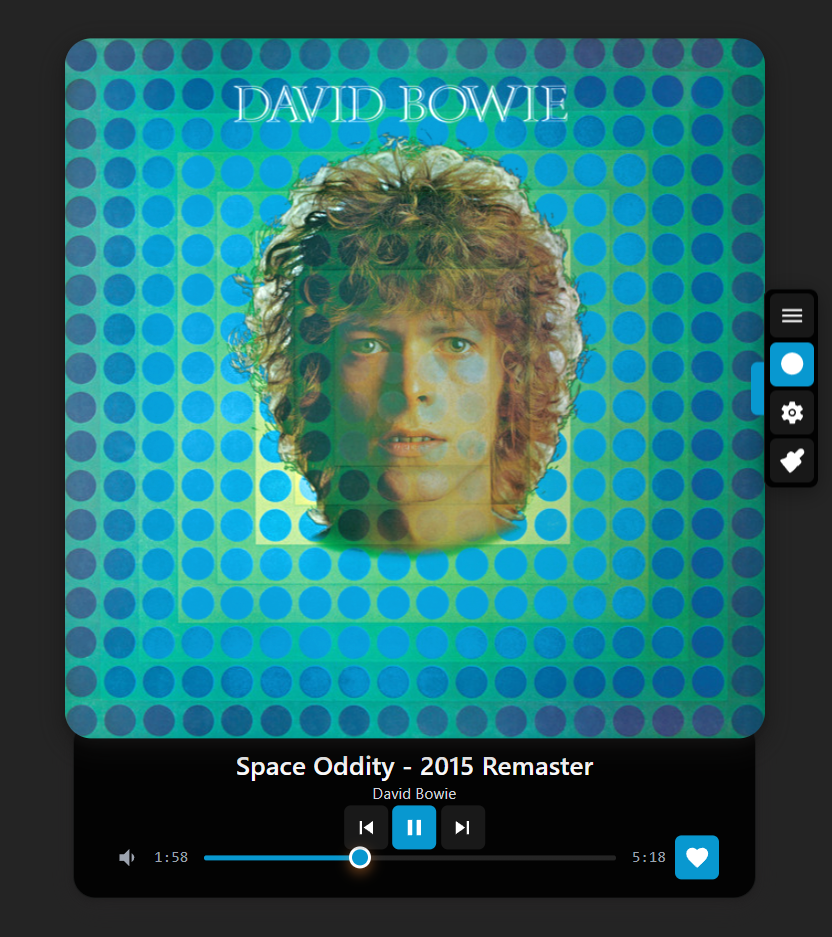

# Vorbis Player

A React-based Spotify music player with visual effects and album art display.




## Features

- **Spotify Integration**: Stream music from your Spotify account (Premium required)
- **Playlist Support**: Access playlists and Liked Songs with shuffle support
- **Visual Effects**: Dynamic album art with customizable filters and glow effects
- **Background Visualizer**: Animated particle and geometric visualizers
- **Three-Column Layout**: Track info, controls, and settings in a fixed 768px x 880px layout
- **Responsive Design**: Mobile-optimized with touch-friendly controls

## Quick Start

### Prerequisites

- Node.js 18+ and npm
- A Spotify Premium account
- Access to Spotify Developer Dashboard

### Installation

1. **Clone and install dependencies**

   ```bash
   git clone git@github.com:smallorbit/vorbis-player.git
   cd vorbis-player
   npm install
   ```

2. **Set up Spotify App**
   - Create a new app at [Spotify Developer Dashboard](https://developer.spotify.com/dashboard)
   - Choose "Web Playback SDK" for planned API usage
   - Add redirect URI: `http://127.0.0.1:3000/auth/spotify/callback`
   - **Important**: Use `127.0.0.1` instead of `localhost` for Spotify OAuth compatibility
   - Copy your Client ID

3. **Configure environment**

   ```bash
   cp .env.example .env.local
   # Edit .env.local with your Spotify Client ID
   ```

   Required in `.env.local`:

   ```
   VITE_SPOTIFY_CLIENT_ID="your_spotify_client_id_here"
   VITE_SPOTIFY_REDIRECT_URI="http://127.0.0.1:3000/auth/spotify/callback"
   ```

4. **Start the app**

   ```bash
   npm run dev
   ```

5. **First run**
   - Open <http://127.0.0.1:3000>
   - Click "Connect Spotify" to authenticate
   - Choose from your playlists or select "Liked Songs" for shuffled playback

## User Interface

### Quick Actions Panel (Left Side)

The left quick actions panel provides quick access to visual effects controls:

- **Visual Effects Toggle** (✨): Enable or disable glow effects on the album art
- **Background Visualizer Toggle** (💠): Enable or disable the animated background visualizer

The panel can be collapsed/expanded by clicking the accent-colored handle on the right edge.

### Control Toolbar

The main control toolbar includes:

- **Playback Controls**: Previous track, Play/Pause, Next track
- **Visual Effects Toggle** (✨): Quick toggle for glow effects
- **Visual Effects Menu** (⚙️): Opens the visual effects configuration drawer

### Visual Effects Menu

The visual effects menu (opened via the ⚙️ button) provides comprehensive control over all visual effects:

#### Glow Effect
- **Intensity**: Adjust glow intensity (Less/Normal/More)
- **Rate**: Control animation speed (Slower/Normal/Faster)
- **Accent Color Background**: Toggle accent color background overlay (On/Off)

#### Background Visualizer
- **Visualizer Style**: Choose between Particles or Geometric patterns
- **Visualizer Intensity**: Adjust intensity from 0-100% using a slider

#### Album Art Filters
- **Brightness**: Less/Normal/More
- **Saturation**: Less/Normal/More
- **Sepia**: None/Some/More
- **Contrast**: Less/Normal/More
- **Reset All Filters**: Restore all filters to default values

### Keyboard Shortcuts

- `Space`: Play/Pause
- `←` / `→`: Previous/Next track
- `P`: Toggle playlist drawer
- `V`: Toggle visual effects

## Development

### Available Scripts

```bash
npm run dev          # Start development server
npm run build        # Build for production  
npm run lint         # Run ESLint
npm run preview      # Preview production build
npm run test         # Run tests in watch mode
npm run test:run     # Run tests once
npm run test:ui      # Run tests with UI
npm run test:coverage # Run tests with coverage
```

### Project Structure

```
src/
├── components/           # React components
│   ├── AudioPlayer.tsx  # Main audio player orchestrator
│   ├── AlbumArt.tsx     # Album artwork display with visual effects
│   ├── Playlist.tsx     # Collapsible track listing drawer
│   ├── PlaylistSelection.tsx # Playlist selection interface
│   ├── LikeButton.tsx    # Heart-shaped button for liking/unliking tracks
│   ├── SpotifyPlayerControls.tsx # Three-column player control interface
│   ├── VisualEffectsMenu.tsx # Visual effects control menu
│   ├── styled/          # styled-components UI library
│   └── ui/              # Radix UI components and utilities
├── hooks/               # Custom React hooks
├── services/            # External service integrations
│   ├── spotify.ts      # Spotify Web API integration
│   └── spotifyPlayer.ts # Spotify Web Playback SDK
├── styles/             # Styling system
├── utils/              # Utilities
└── lib/                # Helper functions
```

### Tech Stack

- **Frontend**: React 18 + TypeScript + Vite
- **Styling**: styled-components with Radix UI primitives
- **Audio**: Spotify Web Playback SDK
- **Authentication**: Spotify Web API with PKCE OAuth
- **Testing**: Vitest with React Testing Library

## Deployment

### Deploy to Vercel (Recommended)

For detailed step-by-step instructions, see [deploy-to-vercel.md](./docs/deployment/deploy-to-vercel.md).

**Quick Deploy:**
1. Push your code to GitHub/GitLab/Bitbucket
2. Connect your repository to [Vercel](https://vercel.com)
3. Set environment variables:
   - `VITE_SPOTIFY_CLIENT_ID`: Your Spotify app's Client ID
   - `VITE_SPOTIFY_REDIRECT_URI`: `https://your-app.vercel.app/auth/spotify/callback`
4. Deploy!

### Manual Build

```bash
npm run build
```

The `dist/` folder contains static files that can be deployed to any web hosting service.

**Important**: 
- Update the Spotify redirect URI in your app settings to match your production domain
- Set up environment variables on your hosting platform

## Troubleshooting

### "No tracks found"
- Ensure you have a Spotify Premium subscription
- Create playlists with music or like some songs in Spotify
- Check that your Spotify account has music accessible

### Authentication Issues
- Double-check your Client ID in `.env.local`
- Ensure redirect URI matches exactly in both `.env.local` and Spotify app settings
- Use `127.0.0.1` instead of `localhost` for Spotify OAuth compatibility

### Visual Effects Issues
- If visual effects aren't working, try refreshing the page
- Clear localStorage to reset visual settings to defaults
- Ensure your browser supports CSS filters and backdrop-blur effects
- Background visualizer requires WebGL support - check your browser compatibility
