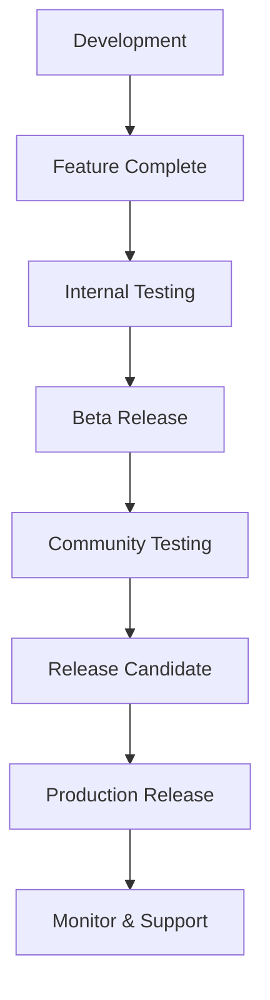
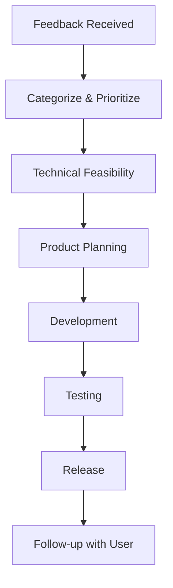

# Migration and Maintenance Strategy

## Overview

This document outlines the comprehensive strategy for migrating from a dual-mode Vorbis Player to separate web and desktop applications, along with long-term maintenance approaches. The strategy addresses technical migration, user experience continuity, data preservation, and ongoing maintenance responsibilities.

---

## Migration Strategy

### 1. Pre-Migration Preparation

#### 1.1 Data Backup and Export Strategy
**Timeline**: Week -2 to Week -1 (before extraction begins)

**User Data Inventory**:
- Local music library database (SQLite)
- User preferences and settings
- Custom playlists and favorites
- Play history and statistics
- Visual effects configurations
- Window layouts and UI preferences

**Backup Implementation**:
```typescript
// Backup service for user data preservation
interface UserDataBackup {
  version: string;
  timestamp: string;
  database: {
    tracks: Track[];
    playlists: Playlist[];
    settings: UserSettings;
    statistics: PlaybackStatistics;
  };
  preferences: {
    ui: UIPreferences;
    audio: AudioSettings;
    library: LibrarySettings;
  };
}
```

**Backup Process**:
1. **Automatic Backup**: Before any update that affects data structure
2. **Manual Backup**: User-initiated export functionality
3. **Cloud Backup**: Optional encrypted cloud storage
4. **Format**: JSON with schema versioning for forward compatibility

#### 1.2 User Communication Strategy
**Timeline**: 4 weeks before migration

**Communication Channels**:
- In-app notifications with migration timeline
- Email notifications to registered users
- Website banner with detailed information
- Social media announcements
- GitHub repository updates

**Key Messages**:
- Benefits of the separation (performance, features, maintenance)
- Timeline and what to expect
- Data safety and migration guarantees
- New features coming to each version
- Support resources and contact information

**Communication Template**:
```
🎵 Vorbis Player Evolution: Better Performance, Better Experience

We're splitting Vorbis Player into two optimized applications:
• Vorbis Web: Enhanced Spotify streaming experience
• Vorbis Desktop: Powerful local music library manager

Your data is safe - automatic migration included.
Expected timeline: [Date]
Learn more: [Link to detailed guide]
```

### 2. Technical Migration Process

#### 2.1 Codebase Separation Timeline
**Phase 1: Foundation (Week 1)**
- Create vorbis-desktop repository
- Set up build and CI/CD pipeline
- Extract core desktop functionality
- Establish shared component libraries

**Phase 2: Feature Migration (Weeks 2-3)**
- Migrate local music services
- Extract and optimize desktop components
- Remove web-specific dependencies
- Implement desktop-specific enhancements

**Phase 3: Data Migration (Week 4)**
- Implement automatic data migration
- Create migration validation tools
- Test with various library sizes
- Implement rollback mechanisms

**Phase 4: Testing (Weeks 5-6)**
- Comprehensive testing across platforms
- Performance regression testing
- User acceptance testing
- Migration scenario testing

**Phase 5: Release (Week 7)**
- Production release preparation
- Staged rollout to users
- Monitor migration success
- Provide user support

#### 2.2 Data Migration Implementation

**Migration Service Architecture**:
```typescript
interface MigrationService {
  // Detect current installation and data
  detectCurrentInstallation(): InstallationInfo;
  
  // Backup current data
  createBackup(): Promise<BackupResult>;
  
  // Migrate data to new format
  migrateData(backup: UserDataBackup): Promise<MigrationResult>;
  
  // Validate migration success
  validateMigration(): Promise<ValidationResult>;
  
  // Rollback if needed
  rollbackMigration(): Promise<RollbackResult>;
}
```

**Migration Steps**:
1. **Detection**: Identify existing Vorbis Player installation
2. **Backup**: Create comprehensive backup of all user data
3. **Schema Migration**: Update database schema to new version
4. **Data Transfer**: Migrate tracks, playlists, and settings
5. **Validation**: Verify data integrity and completeness
6. **Cleanup**: Remove old data after successful migration

**Migration Validation**:
- Track count verification
- Playlist integrity checks
- Settings preservation validation
- Performance benchmark comparison
- User preference migration verification

#### 2.3 Rollback Strategy

**Rollback Triggers**:
- Migration failure or data corruption
- Critical bugs in new version
- User dissatisfaction or issues
- Performance regression beyond acceptable limits

**Rollback Implementation**:
```typescript
interface RollbackService {
  // Check if rollback is possible
  canRollback(): boolean;
  
  // Execute rollback to previous version
  executeRollback(): Promise<RollbackResult>;
  
  // Restore user data from backup
  restoreUserData(backup: UserDataBackup): Promise<RestoreResult>;
  
  // Validate rollback success
  validateRollback(): Promise<ValidationResult>;
}
```

**Rollback Process**:
1. **Stop Current Version**: Gracefully shut down new application
2. **Restore Previous Version**: Reinstall previous version if needed
3. **Restore Data**: Restore user data from backup
4. **Validate Restoration**: Ensure all data is accessible
5. **User Notification**: Inform user of rollback and next steps

### 3. User Experience Migration

#### 3.1 Onboarding for Existing Users

**First Launch Experience**:
1. **Welcome Screen**: Explain the changes and improvements
2. **Data Migration Status**: Show migration progress and results
3. **Feature Tour**: Highlight new desktop-specific features
4. **Settings Review**: Allow users to review and adjust settings
5. **Library Verification**: Let users verify their music library

**Migration UI Components**:
```typescript
// Migration progress component
const MigrationProgress = () => {
  return (
    <MigrationContainer>
      <ProgressBar value={migrationProgress} />
      <StatusMessage>
        Migrating your music library... {currentStep}
      </StatusMessage>
      <Details>
        {migratedTracks} of {totalTracks} tracks migrated
      </Details>
    </MigrationContainer>
  );
};
```

#### 3.2 Feature Parity Maintenance

**Critical Features to Maintain**:
- All current local music playback functionality
- Visual effects and customization options
- Playlist management and organization
- Library browsing and search
- Performance and quality settings

**Enhanced Features for Desktop**:
- Improved file system integration
- Better performance with large libraries
- Enhanced audio quality options
- Native OS integration features
- Advanced library management tools

#### 3.3 Support and Documentation

**Migration Support Resources**:
- Detailed migration guide with screenshots
- Video tutorials for complex scenarios
- FAQ addressing common migration issues
- Live chat support during migration period
- Community forum for user assistance

**Documentation Structure**:
```
docs/migration/
├── getting-started.md          # Basic migration guide
├── troubleshooting.md          # Common issues and solutions
├── data-recovery.md            # Data recovery procedures
├── feature-comparison.md       # Web vs Desktop features
├── advanced-migration.md       # Complex scenarios
└── rollback-guide.md          # How to rollback if needed
```

---

## Long-Term Maintenance Strategy

### 1. Development Organization

#### 1.1 Team Structure

**Core Teams**:
- **Web Team**: Focuses on Vorbis Web development
- **Desktop Team**: Focuses on Vorbis Desktop development
- **Shared Libraries Team**: Maintains shared components
- **Infrastructure Team**: Manages CI/CD and deployment

**Responsibilities Matrix**:
| Component | Web Team | Desktop Team | Shared Team | Infrastructure |
|-----------|----------|--------------|-------------|----------------|
| Web App | Primary | - | Consumer | Support |
| Desktop App | - | Primary | Consumer | Support |
| Shared UI | Consumer | Consumer | Primary | - |
| Design Tokens | Consumer | Consumer | Primary | - |
| CI/CD | - | - | - | Primary |
| Documentation | Contributor | Contributor | Primary | Contributor |

#### 1.2 Communication and Coordination

**Regular Meetings**:
- **Weekly Standup**: All teams, progress and blockers
- **Bi-weekly Planning**: Feature planning and prioritization
- **Monthly Architecture Review**: Technical decisions and alignment
- **Quarterly Retrospective**: Process improvement and strategy

**Communication Channels**:
- Slack channels for each team and shared discussions
- GitHub discussions for technical architecture decisions
- Notion/Confluence for documentation and planning
- Video calls for complex technical discussions

### 2. Release Management

#### 2.1 Versioning Strategy

**Semantic Versioning**:
- **Major (X.0.0)**: Breaking changes, major feature additions
- **Minor (X.Y.0)**: New features, backward compatible
- **Patch (X.Y.Z)**: Bug fixes, security updates

**Release Cadence**:
- **Major Releases**: Every 6 months
- **Minor Releases**: Every 4-6 weeks
- **Patch Releases**: As needed, typically weekly
- **Security Releases**: Immediate (within 24-48 hours)

**Version Alignment**:
- Shared libraries follow independent versioning
- Applications can use different versions of shared libraries
- Security updates propagated to all versions immediately

#### 2.2 Release Process

**Shared Libraries Release Process**:


**Application Release Process**:
1. **Development Phase**: Feature development and testing
2. **Integration Testing**: Test with latest shared libraries
3. **Beta Release**: Limited user testing
4. **Release Candidate**: Final testing and validation
5. **Production Release**: Staged rollout to all users
6. **Post-Release Monitoring**: Performance and error tracking

#### 2.3 Dependency Management

**Shared Library Updates**:
- Applications pin specific versions of shared libraries
- Regular dependency update cycles (monthly)
- Automated security update notifications
- Breaking change migration guides

**Third-Party Dependencies**:
- Regular security audits and updates
- Automated dependency update PRs
- Testing matrix for dependency compatibility
- Fallback strategies for deprecated dependencies

### 3. Quality Assurance

#### 3.1 Testing Strategy

**Test Types and Coverage**:
- **Unit Tests**: >90% coverage for shared libraries, >80% for applications
- **Integration Tests**: Critical user flows and API integrations
- **E2E Tests**: Complete user scenarios across platforms
- **Performance Tests**: Load testing and performance regression
- **Security Tests**: Vulnerability scanning and penetration testing

**Testing Infrastructure**:
```yaml
# GitHub Actions testing matrix
strategy:
  matrix:
    os: [ubuntu-latest, windows-latest, macos-latest]
    node-version: [18.x, 20.x]
    include:
      - os: ubuntu-latest
        test-type: unit
      - os: windows-latest
        test-type: integration
      - os: macos-latest
        test-type: e2e
```

#### 3.2 Performance Monitoring

**Key Performance Indicators**:
- Application startup time (<2 seconds)
- Memory usage (baseline <200MB)
- Library scan performance (>1000 files/second)
- UI responsiveness (60fps, <16ms frame time)
- Database query performance (<100ms)

**Monitoring Tools**:
- Application performance monitoring (APM)
- Error tracking and alerting
- User behavior analytics
- Performance regression detection
- Automated performance testing

### 4. User Support and Feedback

#### 4.1 Support Channels

**Primary Support Channels**:
- **GitHub Issues**: Bug reports and feature requests
- **Community Forum**: User discussions and support
- **Documentation**: Comprehensive guides and tutorials
- **Email Support**: Direct support for complex issues

**Support Tiers**:
- **Community Support**: Forum-based peer support
- **Standard Support**: GitHub issues with response SLA
- **Priority Support**: Email support for critical issues
- **Enterprise Support**: Dedicated support for organizations

#### 4.2 Feedback Collection and Implementation

**Feedback Mechanisms**:
- In-app feedback forms
- User surveys and polls
- Feature request voting
- Beta testing programs
- User interview sessions

**Feedback Processing**:


### 5. Documentation and Knowledge Management

#### 5.1 Documentation Strategy

**Documentation Types**:
- **User Documentation**: Installation, usage, and troubleshooting
- **Developer Documentation**: API references and contribution guides
- **Architecture Documentation**: System design and technical decisions
- **Process Documentation**: Development workflows and procedures

**Documentation Tools**:
- GitBook or Notion for user-facing documentation
- GitHub Wiki for developer documentation
- ADRs (Architecture Decision Records) for technical decisions
- Automated API documentation generation

#### 5.2 Knowledge Sharing

**Internal Knowledge Sharing**:
- Tech talks and lunch-and-learns
- Code review best practices
- Pair programming sessions
- Architecture decision discussions

**External Knowledge Sharing**:
- Blog posts about technical challenges and solutions
- Open source contributions and community engagement
- Conference talks and presentations
- Technical documentation and tutorials

---

## Risk Management and Mitigation

### 1. Technical Risks

#### 1.1 Data Loss or Corruption
**Risk**: User data lost or corrupted during migration
**Mitigation**:
- Comprehensive backup strategy before migration
- Multiple validation layers during migration
- Rollback mechanisms with data restoration
- Extensive testing with various data scenarios

#### 1.2 Performance Regression
**Risk**: New applications perform worse than current version
**Mitigation**:
- Performance benchmarking before and after migration
- Automated performance testing in CI/CD
- Performance monitoring in production
- Performance optimization sprints if needed

#### 1.3 Platform Compatibility Issues
**Risk**: Applications don't work on all supported platforms
**Mitigation**:
- Comprehensive cross-platform testing matrix
- Platform-specific testing and validation
- Community beta testing on various configurations
- Platform maintainer responsibilities

### 2. User Experience Risks

#### 2.1 User Confusion and Adoption Issues
**Risk**: Users confused by changes or reluctant to migrate
**Mitigation**:
- Clear communication strategy with advance notice
- Comprehensive migration guides and tutorials
- Onboarding experience for migrated users
- Support resources and assistance during transition

#### 2.2 Feature Regression
**Risk**: Users lose functionality they depend on
**Mitigation**:
- Feature parity analysis and documentation
- User feedback collection before and after migration
- Rapid response to critical missing features
- Rollback option if significant issues arise

### 3. Business Risks

#### 3.1 Increased Development Overhead
**Risk**: Maintaining two applications increases development cost
**Mitigation**:
- Shared component libraries to reduce duplication
- Clear team responsibilities and boundaries
- Automated testing and deployment processes
- Regular evaluation of shared vs. separate development

#### 3.2 User Base Fragmentation
**Risk**: User base splits between web and desktop versions
**Mitigation**:
- Clear positioning and benefits for each version
- Cross-promotion between applications
- Shared user accounts and data sync options
- Unified branding and user experience

---

## Success Metrics and Monitoring

### 1. Migration Success Metrics

**Technical Metrics**:
- Migration completion rate: >95%
- Data integrity validation: 100%
- Performance improvement: >20% startup time
- Error rate reduction: <1% critical errors

**User Experience Metrics**:
- User satisfaction score: >4.0/5.0
- Feature adoption rate: >80% for key features
- Support ticket reduction: <50% migration-related issues
- User retention rate: >90% post-migration

### 2. Long-Term Success Metrics

**Development Metrics**:
- Development velocity: Feature delivery time
- Code quality: Test coverage, bug rates
- Maintenance overhead: Time spent on maintenance vs. new features
- Team satisfaction: Developer experience and productivity

**Product Metrics**:
- User growth: Active user count and growth rate
- Feature usage: Adoption of new and existing features
- Performance: Application performance and reliability
- User feedback: Satisfaction scores and feedback sentiment

### 3. Monitoring and Reporting

**Regular Reports**:
- Weekly development progress reports
- Monthly user metrics and feedback summary
- Quarterly business impact assessment
- Annual strategy review and planning

**Dashboards and Alerts**:
- Real-time application performance monitoring
- User behavior and engagement tracking
- Error and incident tracking
- Development team productivity metrics

---

## Conclusion

The migration and maintenance strategy outlined above provides a comprehensive approach to successfully separating the Vorbis Player into dedicated web and desktop applications while maintaining user satisfaction and development efficiency.

**Key Success Factors**:
1. **Thorough Preparation**: Comprehensive planning and risk assessment
2. **User-Centric Approach**: Focus on user experience and data safety
3. **Technical Excellence**: Robust migration and rollback mechanisms
4. **Clear Communication**: Transparent communication with users and stakeholders
5. **Ongoing Support**: Comprehensive support during and after migration
6. **Continuous Improvement**: Regular evaluation and optimization

**Expected Outcomes**:
- **Improved Performance**: Applications optimized for their specific use cases
- **Better User Experience**: Platform-specific features and optimizations
- **Reduced Complexity**: Simplified codebase and development processes
- **Increased Maintainability**: Focused teams and clear responsibilities
- **Enhanced Innovation**: Faster feature development and iteration

This strategy balances the technical requirements of the migration with the user experience and business considerations, ensuring a successful transition to the new architecture while maintaining the quality and reliability that Vorbis Player users expect.